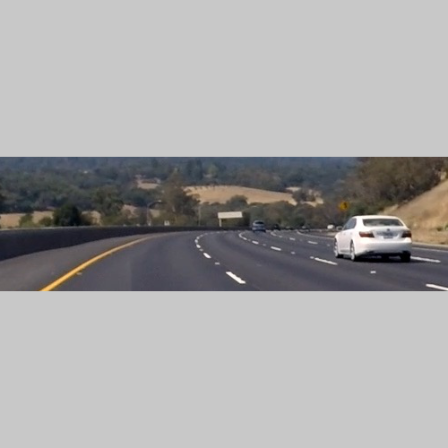
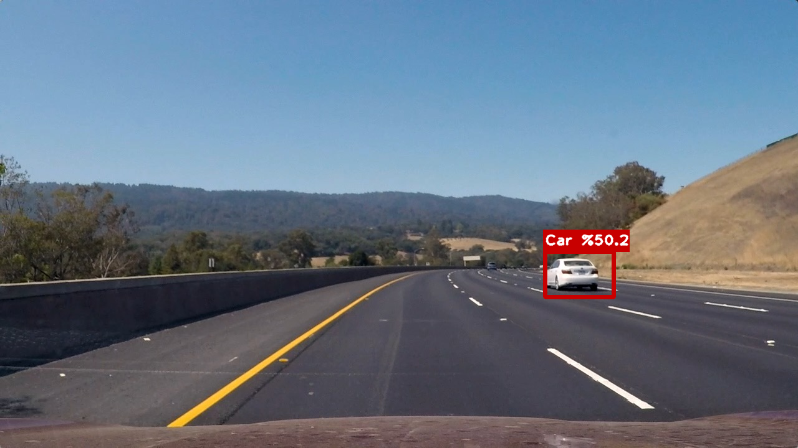
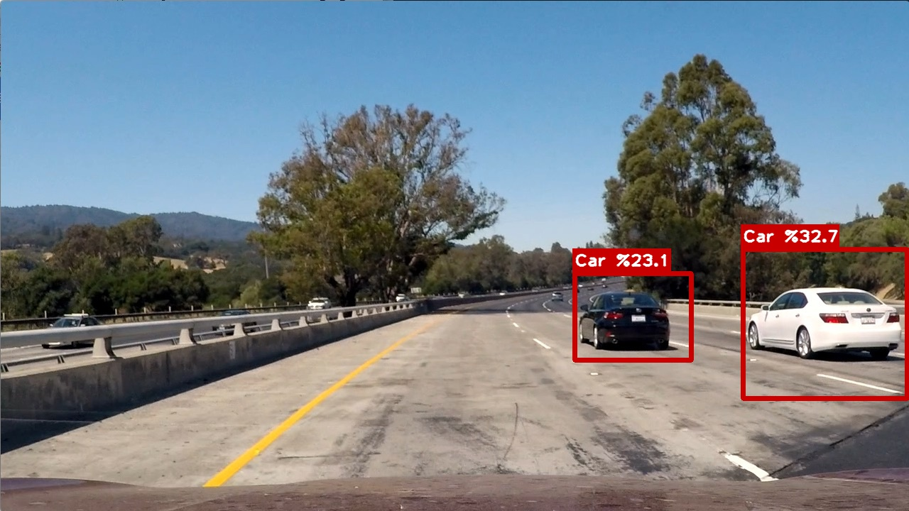
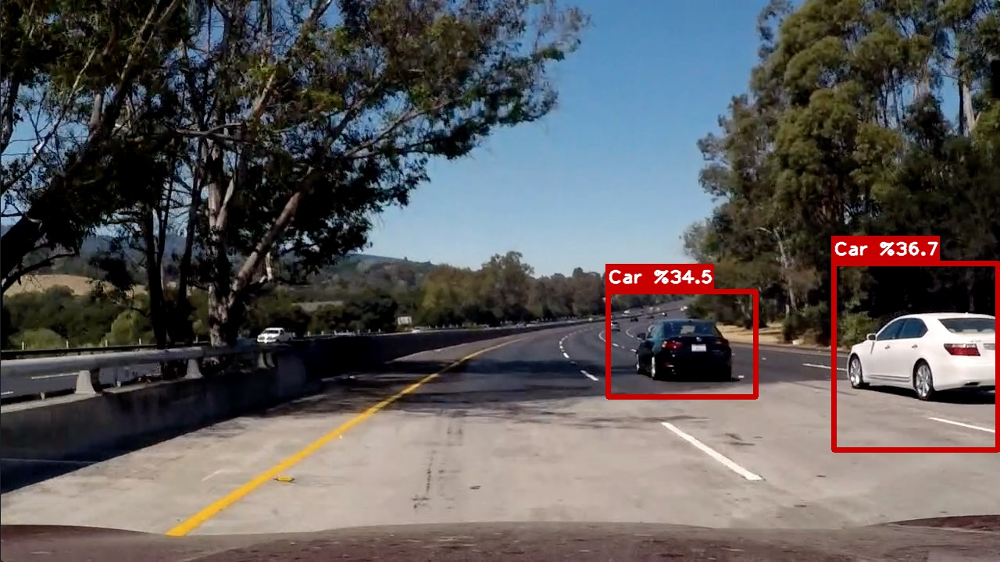

# Vehicle Detection
The goal of the project is to detect and draw squares around cars in dashcam footage. I used a YOLO image detection network to predict the boxes and labels that I put on the image. I choose to use a one-shot approach to this instead of the Udacity recommended approach for a few reasons:

1. I love deep learning and I’ll have much more fun playing with Neural networks than I will with more traditional approaches
2. I’ve heard models like this are more commonly used in the industry than the HOG/SVM style approach Udacity teaches

I also choose to implement it in Keras because it's accessable and makes the nice and small. On that note, I've tried to include a more detailed description of YOLO's output than you can find anywhere else by googling. I spent a long time figuring out what each number meant and hopefully you won't have to do so. I've also put some effort into commenting profusely throughout the [`utils.py`](utils/utils.py) file to make it easy to understand. Feel free to use any parts of this code you want.

## What is YOLO?
"YOLO" or "You Only Look Once" (hah ಠ_ಠ), is a massive Convolutional Nueral network for object detection and classification. As a quote from its [website](https://pjreddie.com/darknet/yolo/) explains “This network divides the image into regions and predicts bounding boxes and probabilities for each region. These bounding boxes are weighted by the predicted probabilities.”

YOLO is a great network and on the cutting edge of object detection, but… it’s really big and it’s really slow. So since I’m not looking to put this network in a car, I decided to use the smaller [Tiny-YOLO](https://pjreddie.com/darknet/tiny-darknet/) instead.

## tiny-YOLO architecture

    ____________________________________________________________________________________________________
    Layer (type)                     Output Shape          Param #     Connected to                     
    ====================================================================================================
    convolution2d_1 (Convolution2D)  (None, 16, 448, 448)  448         convolution2d_input_1[0][0]      
    ____________________________________________________________________________________________________
    leakyrelu_1 (LeakyReLU)          (None, 16, 448, 448)  0           convolution2d_1[0][0]            
    ____________________________________________________________________________________________________
    maxpooling2d_1 (MaxPooling2D)    (None, 16, 224, 224)  0           leakyrelu_1[0][0]                
    ____________________________________________________________________________________________________
    convolution2d_2 (Convolution2D)  (None, 32, 224, 224)  4640        maxpooling2d_1[0][0]             
    ____________________________________________________________________________________________________
    leakyrelu_2 (LeakyReLU)          (None, 32, 224, 224)  0           convolution2d_2[0][0]            
    ____________________________________________________________________________________________________
    maxpooling2d_2 (MaxPooling2D)    (None, 32, 112, 112)  0           leakyrelu_2[0][0]                
    ____________________________________________________________________________________________________
    convolution2d_3 (Convolution2D)  (None, 64, 112, 112)  18496       maxpooling2d_2[0][0]             
    ____________________________________________________________________________________________________
    leakyrelu_3 (LeakyReLU)          (None, 64, 112, 112)  0           convolution2d_3[0][0]            
    ____________________________________________________________________________________________________
    maxpooling2d_3 (MaxPooling2D)    (None, 64, 56, 56)    0           leakyrelu_3[0][0]                
    ____________________________________________________________________________________________________
    convolution2d_4 (Convolution2D)  (None, 128, 56, 56)   73856       maxpooling2d_3[0][0]             
    ____________________________________________________________________________________________________
    leakyrelu_4 (LeakyReLU)          (None, 128, 56, 56)   0           convolution2d_4[0][0]            
    ____________________________________________________________________________________________________
    maxpooling2d_4 (MaxPooling2D)    (None, 128, 28, 28)   0           leakyrelu_4[0][0]                
    ____________________________________________________________________________________________________
    convolution2d_5 (Convolution2D)  (None, 256, 28, 28)   295168      maxpooling2d_4[0][0]             
    ____________________________________________________________________________________________________
    leakyrelu_5 (LeakyReLU)          (None, 256, 28, 28)   0           convolution2d_5[0][0]            
    ____________________________________________________________________________________________________
    maxpooling2d_5 (MaxPooling2D)    (None, 256, 14, 14)   0           leakyrelu_5[0][0]                
    ____________________________________________________________________________________________________
    convolution2d_6 (Convolution2D)  (None, 512, 14, 14)   1180160     maxpooling2d_5[0][0]             
    ____________________________________________________________________________________________________
    leakyrelu_6 (LeakyReLU)          (None, 512, 14, 14)   0           convolution2d_6[0][0]            
    ____________________________________________________________________________________________________
    maxpooling2d_6 (MaxPooling2D)    (None, 512, 7, 7)     0           leakyrelu_6[0][0]                
    ____________________________________________________________________________________________________
    convolution2d_7 (Convolution2D)  (None, 1024, 7, 7)    4719616     maxpooling2d_6[0][0]             
    ____________________________________________________________________________________________________
    leakyrelu_7 (LeakyReLU)          (None, 1024, 7, 7)    0           convolution2d_7[0][0]            
    ____________________________________________________________________________________________________
    convolution2d_8 (Convolution2D)  (None, 1024, 7, 7)    9438208     leakyrelu_7[0][0]                
    ____________________________________________________________________________________________________
    leakyrelu_8 (LeakyReLU)          (None, 1024, 7, 7)    0           convolution2d_8[0][0]            
    ____________________________________________________________________________________________________
    convolution2d_9 (Convolution2D)  (None, 1024, 7, 7)    9438208     leakyrelu_8[0][0]                
    ____________________________________________________________________________________________________
    leakyrelu_9 (LeakyReLU)          (None, 1024, 7, 7)    0           convolution2d_9[0][0]            
    ____________________________________________________________________________________________________
    flatten_1 (Flatten)              (None, 50176)         0           leakyrelu_9[0][0]                
    ____________________________________________________________________________________________________
    dense_1 (Dense)                  (None, 256)           12845312    flatten_1[0][0]                  
    ____________________________________________________________________________________________________
    dense_2 (Dense)                  (None, 4096)          1052672     dense_1[0][0]                    
    ____________________________________________________________________________________________________
    leakyrelu_10 (LeakyReLU)         (None, 4096)          0           dense_2[0][0]                    
    ____________________________________________________________________________________________________
    dense_3 (Dense)                  (None, 1470)          6022590     leakyrelu_10[0][0]               
    ====================================================================================================
    Total params: 45,089,374
    Trainable params: 45,089,374
    Non-trainable params: 0
    ____________________________________________________________________________________________________

As you can see, tiny-YOLO has 9 convolutional layers and is only tiny when compared to the normal YOLO which has 24.

## YOLO Output: Overview

These next four sections get into the nitty gritty of what the network produces. I’d recommend skipping them if you don’t want to implement this yourself. These outputs are the same for YOLO and Tiny-YOLO.

This network outputs a vector of 1470 numbers that are divided into three sections.

YOLO's sorts it's output by the 49 grid cells (7x7) that it divides the image into. The cells are represented in this array left to right, then top to bottom. The data is organized into three parts which I will describe below.

### YOLO Output: Probability
This is the simplest one, there are 20 classes that the network can predict. 20 classes * 49 cells = the 980 numbers that are in this part of the vector. So 0-19 of the vector is the relative probabilities that the top left cell is categorized as each class. For this project, I only care about identifying cars, so I only use index 6. This corresponds to the car class in the dataset that tiny yolo was originally trained on.

### YOLO Output: Confidence
Each cell in the grid is responsible for predicting two bounding boxes. Thus there is one number in this section of 98 of each of those bounding boxes in each cell (49*2). Each "confidence score" is the probability that there is an object within that bounding box. This doesn't tell you anything about the shape of the box, or what's in it, just whether there is something there.

### YOLO Output: Box Coordinates
This is where the boxes are predicted. Each box is represented with four numbers (x,y,width,height). These numbers are relative to the cell they're in and have to be scaled to be represented on the entire image. Once again, each cell predicts two bounding boxes so 2 boxes * 4 number per box * 49 cells = 392 numbers.

## Weights/Training
I don't have a big deep learning computer so even with the tiny-YOLO I need to either use a cpu so it gets stored in RAM or use pre trained weights. I choose the latter. The weights I used are from the darknet site and are from training the model on the VOC2012 Dataset. This is why there are 20 classes to choose from even though we'd be happy with just a car class.

I didn't include the weights here because github doesn't like big files, but you can download them yourself [here](https://pjreddie.com/media/files/yolo.weights)

## Making up for size difference
The model I'm using is trained to recognize objects that are generally much closer (and thus bigger) than the cars I'm trying to detect, so I had to work around it. Along with running YOLO on the whole image, I also ran it on subsections. The fixed subsection was zoomed in on the highway ahead to try to get farther cars. But I also kept track of where detected cars were and tried to find them in a zoomed in image of that position again in the next few frames. This also made up for some of the performance loss I got from using tiny-yolo vs the full model.

Here's an example of the standard cropping i do to zoom the image in on the highway ahead. As you can see, padding has been automatically added on the top and bottom to make the image the proper 448x448.

## Heatmapping
I used a heatmap of the past 8 frames to eliminate most false detections. False detections are generally flukes and happen for only a frame or two. The heatmap kept track of the total number of detections in any area of the image for the past 8 frames and if there were less than 3, I discarded that detection.

## Results
[Result video](https://youtu.be/2EtTBv0DjKc)

And here are a few example images of the output:

## Reflections
Tiny-YOLO works pretty well but I'd love to see how it could perform with the full YOLO or even SDD. In the future I'd love to have the time and GPU's to train my own YOLO or SDD on open source dashcam datasets.

Additionally, it would be nice to implement a more robust tracking function that could keep track of the velocity of objects. This would make it easy to estimate their position in upcoming frames.

My shortcut of running YOLO multiple times per frame is just that, a shortcut. It would be much better to simply train the full YOLO on a highway dataset so that it would know to look for smaller cars. This would also mean i didn't have to discard 19 out of 20 classes the network produced and would make it more accurate as a result.

I'd also like to keep track of which car is which and use it's mean box for the last few frames to eliminate jitter.

